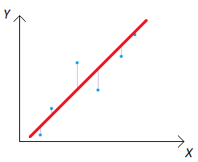

# linear-regression
Calculation of the linear regression equation.

## Introduction
I created my program in Visual Studio 2022 as a simple training project.

## Description
Linear regression is one of the simplest machine learning algorithms. Using a data set like of pairs of values 'X' and 'Y', the algorithm builds a model kind of a straight line equation.
 

## Start the program
Go to "main.cpp" and change "string filePath" to your path. Launch the program in Visual Studio by pressing CTRL+f5. 

Ideally you should get that equation: -0.65x + 6.65.